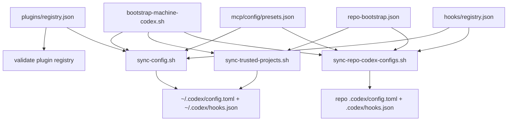
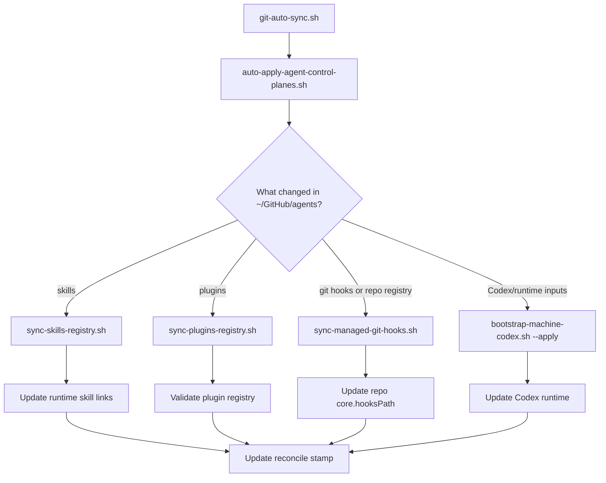
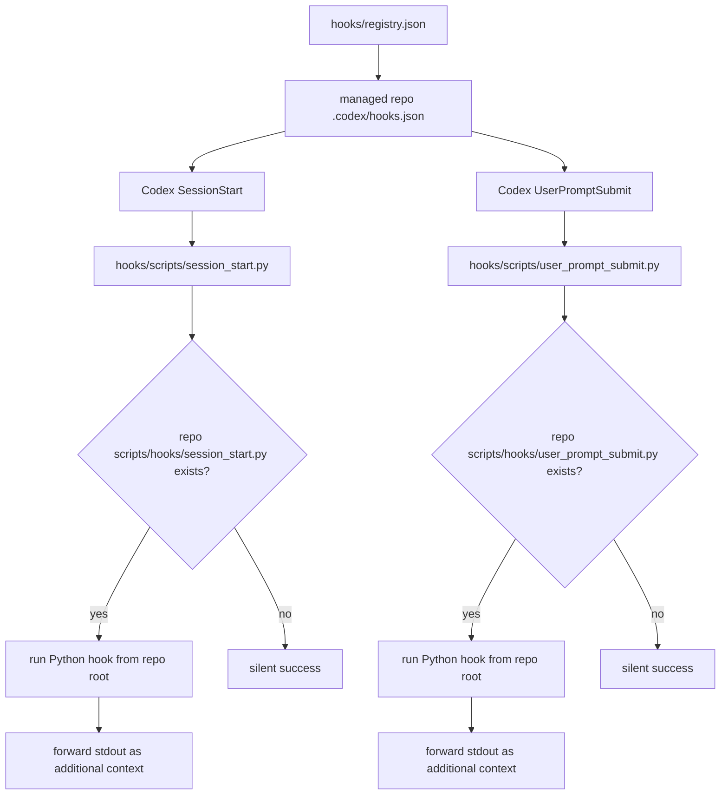
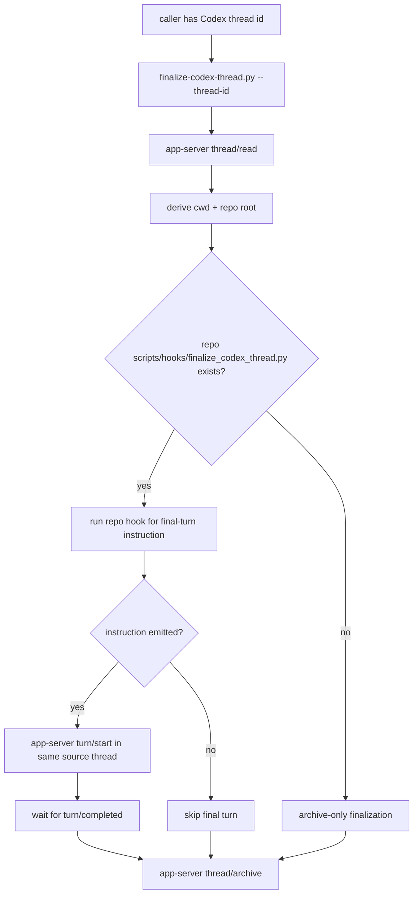
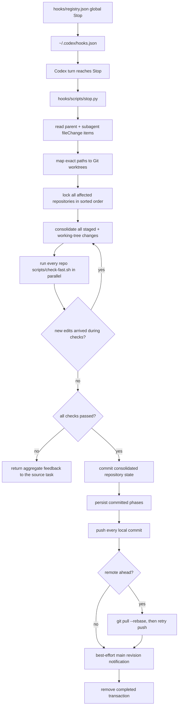

# Codex Control Plane Script Flows

This page breaks the Codex control-plane scripts into a few small flows. Use
[Codex Control Plane](/Users/dobby/GitHub/agents/docs/architecture/codex-control-plane.md)
for the top-level system shape and
[Codex Control Plane Operations](/Users/dobby/GitHub/agents/docs/references/codex-control-plane-operations.md)
for exact commands.

## Apply Flow

Main scripts:

- `codex/scripts/bootstrap-machine-codex.sh`: Codex-specific bootstrap batch.
- `codex/scripts/sync-config.sh`: global Codex config, global hooks, MCPs, and global plugins.
- `codex/scripts/sync-repo-codex-configs.sh`: managed repo `.codex/config.toml` and `.codex/hooks.json`.
- `scripts/sync-plugins-registry.sh`: validates the plugin registry.
- `codex/config/repo-bootstrap.json`: managed repo set and repo-local Codex overrides.

## Post-Sync Reconcile

`scripts/auto-apply-agent-control-planes.sh` keeps a machine-local stamp under
`~/.local/state/agents-control-plane/` so each machine can apply only changes it
has not already reconciled.

## Session And Prompt Dispatch

The shared dispatcher resolves the git root from the hook payload `cwd`, passes a
normalized JSON payload to the repo hook on stdin, and sets
`AGENT_HOOK_EVENT`, `AGENT_HOOK_RUNTIME`, `AGENT_REPO_ROOT`, and
`AGENT_HOOK_SCHEMA_VERSION`.

The control plane does not render a fake native-looking `SessionEnd` hook.
End-of-thread memory work is handled by explicit thread finalization.

## Explicit Thread Finalization

The thread id is the canonical input. Callers should not pass a separate repo
path or directory hint; the finalizer derives that from Codex App Server state.

## Post-Turn Automation

`scripts/check-fast.sh` is the repo-owned fast commit gate for agent-made
changes. Put slower repo-wide validation in `scripts/check-full.sh` or another
explicit command. Codex stores incomplete multi-repository transactions under
`~/.local/state/agents-control-plane/codex-stop-transactions/`, so a later Stop
can finish pushing repositories already committed before another repository
failed. Subagent Stop events defer to their parent; the parent Stop follows
`parentThreadId` recursively and aggregates the complete descendant turn tree.
The transaction also holds a discovery checkpoint while activity retrieval is
incomplete. A later retry replays the original boundary turn and subsequent
activity before finalizing; it cannot treat an empty retry turn as evidence that
only the primary repository changed. Discovery failures preserve state and
return bounded retry feedback without Git mutation.
Repository discovery combines structured file changes, explicit shell registrations,
and executed-command cwd/literal paths through `hooks/scripts/codex_shell_paths.py`.
It does not evaluate command text or inspect command output. Git state under the
existing repository locks remains the authority for what gets consolidated;
unreferenced sibling repos are not scanned.
Concurrent Codex tasks may edit the same
repository or file: the shared working tree is consolidated under the Git lock,
and edits that arrive during checks are restaged and rechecked up to a bounded
retry limit instead of being discarded.

The revision notification is deliberately after a successful push and contains
only the repo root plus final commit SHA. It wakes the shared Mac Mini production
reconciler when that repo is registered. It does not run checks or builds inside
the Stop hook, and a notifier failure cannot reverse an already successful Git
publication. If the Mac mini later pulls that revision, Git auto-sync emits the
same durable notification; the writer health sweep reports remaining revision
drift without deploying it.
